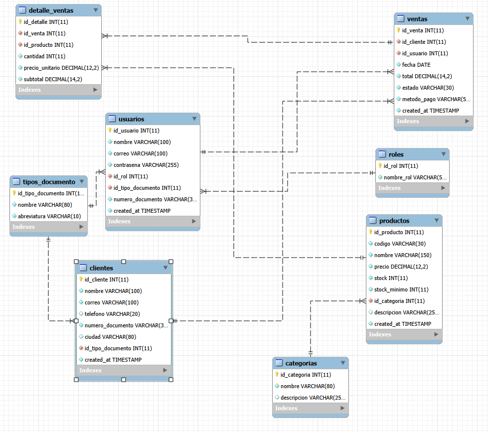

# Diseño e Implementacion de una Aplicacion Web para la Gestión de Ventas de la Tienda de Cosmeticos By Marnin

##  Tecnologías
- PHP (backend y lógica de negocio)
- MySQL (base de datos)
- HTML / CSS / JavaScript (frontend)
- Autenticación con sesiones PHP
- Xampp: Levantamiento de servicios MySQL y Apache Local.

##  Módulos desarrollados
- Autenticación de usuarios
- Gestión de productos
- Gestión de categorias
- Gestion de ventas
- Inventario
- Gestion de clientes
- Gestion de usuarios(Administrador)

## Librerias
- AdminLTE(Con dependencias)

##  Manual de instalacion
- Descargar e instalar el programa Xampp
- Copiar la carpeta del proyecto en la ruta c:/xampp/htdocs/
- Descargar e instalar el programa mysql Workbench la version mas reciente

    

## Diagrama ER

  

